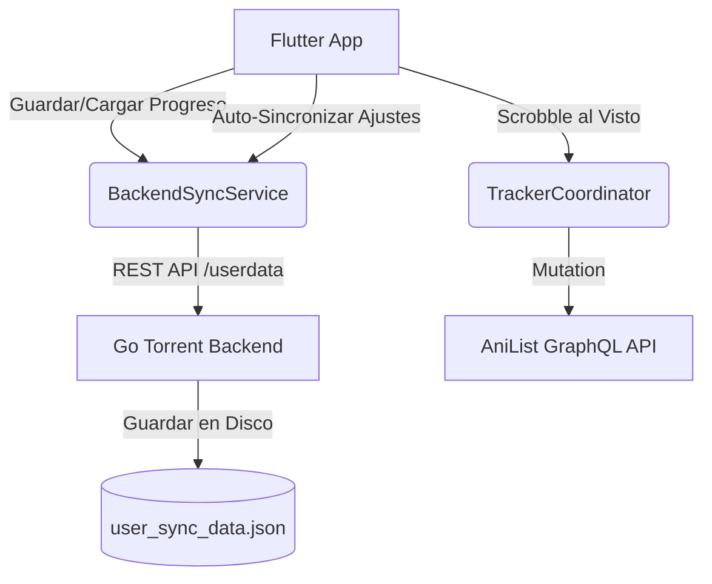

# Plan de Sincronización (AniList, Backend Compartido y UI de Episodios Vistos)

Este documento detalla el plan paso a paso para implementar la sincronización con AniList, el backend compartido (sincronizando progreso de reproducción, configuraciones y rastreadores conectados) y la distinción visual de episodios vistos en la interfaz de usuario.

---

## 1. Arquitectura y Nuevos Componentes

Para mantener el código ordenado y evitar archivos de más de 1,000 líneas, separaremos las responsabilidades en componentes independientes.

### Componentes a crear o modificar:
1. **Go Backend (`backend/engine.go`)**: Creación de un endpoint `/userdata` genérico que permita guardar y cargar archivos JSON de configuración del usuario, trackers y progreso de reproducción en el archivo `user_sync_data.json`.
2. **Flutter Sync Service (`lib/services/backend_sync_service.dart`)**: Servicio central en Dart para enviar peticiones HTTP a `/userdata` para guardar/cargar la posición de vídeo, trackers y configuraciones.
3. **Flutter Settings Service (`lib/services/settings_service.dart`)**: Intercepción de escrituras de ajustes para propagarlas al backend, y carga inicial al iniciar la aplicación.
4. **Playback Progress Tracker (`lib/services/playback_progress_tracker.dart`)**: Habilitación del progreso en directo para guardar la posición en el backend y permitir la scrobbling en AniList.
5. **Tracker Coordinator (`lib/services/trackers/tracker_coordinator.dart`)**: Adaptación para que funcione con `client = null` (reproducción directa) y obtenga los IDs del anime desde los metadatos de AniList directamente.
6. **Episode Card UI (`lib/widgets/episode_card.dart`)**: Cambios de opacidad (0.6), desaturación (escala de grises) y desenfoque suave (sigma 2.0) en la miniatura de los episodios marcados como vistos.

---

## 2. Plan de Implementación Detallado

### Paso 1: Modificación del Backend de Go (`backend/engine.go`)
Añadiremos los métodos `loadUserdata`, `saveUserdata` y la ruta `/userdata` en el servidor Go local:
- **`GET /userdata/{key}`**: Recupera el JSON asociado a la clave.
- **`POST /userdata/{key}`**: Almacena el JSON de la petición y lo guarda en disco de forma persistente.
- **`DELETE /userdata/{key}`**: Elimina la clave y actualiza el archivo.

### Paso 2: Creación del `BackendSyncService` en Flutter (`lib/services/backend_sync_service.dart`)
Este servicio expondrá métodos para:
- `pushSettings()`: serializa las preferencias locales (excluyendo IP, puerto, PIN de conexión y rutas locales para no romper la conectividad de otros clientes) y las sube al backend.
- `pullSettings()`: recupera las preferencias del backend y las guarda localmente en `SharedPreferencesWithCache`, refrescando los notifiers visuales.
- `saveProgress(String syncKey, int positionMs, int durationMs)`: actualiza la posición de reproducción del vídeo en el backend.
- `getProgress(String syncKey)`: lee la posición de reproducción del backend para reanudar.

### Paso 3: Sincronización Automática de Ajustes y Trackers
- Al conectar o iniciar el backend en `main.dart`, llamaremos a `BackendSyncService.pullSettings()`.
- En `SettingsService.write`, si no se está ejecutando un pull activo, se llamará automáticamente a `BackendSyncService.pushSettings()`.
- Dado que las sesiones de rastreadores (MAL, AniList, Simkl, Trakt) se guardan en el mismo `SharedPreferences`, al sincronizar los ajustes también se sincronizan automáticamente todas las cuentas conectadas.

### Paso 4: Corrección de Scrobbling con AniList en Direct Play / Torrents
- Modificaremos `lib/screens/video_player/parts/playback_services.dart` para inicializar el `PlaybackProgressTracker` y el `TrackerCoordinator` incluso si el `mediaClient` de Plex/Jellyfin es nulo.
- Modificaremos `TrackerCoordinator.startPlayback` para que, si `client` es nulo pero el backend es `anilist` o `tmdb`, construya un `TrackerContext` usando directamente los IDs guardados en el `MediaItem`.
- En `PlaybackProgressTracker._sendProgress`, llamaremos a `BackendSyncService.saveProgress` para reportar la posición.

### Paso 5: Recuperar Posición de Reanudación desde el Backend
- En `lib/screens/video_player/parts/playback_open.dart`, modificaremos `_resolveOpenResumePosition` para consultar la posición guardada en el backend antes de recurrir a la posición local.

### Paso 6: Estilizado de Episodios Vistos (`lib/widgets/episode_card.dart`)
- Si `episode.isWatched` es verdadero:
  - Aplicaremos un `ColorFiltered` con matriz de escala de grises sobre el thumbnail.
  - Aplicaremos un `ImageFiltered` con un desenfoque suave (`sigmaX: 2.0, sigmaY: 2.0`).
  - Reduciremos la opacidad del bloque del thumbnail a `0.6`.
  - Reduciremos la opacidad de los textos informativos y el título a `0.7`.
  - Mantendremos el check de color verde/blanco del `WatchedIndicator` arriba a la derecha.

---

## 3. Validación y Pruebas
1. **Verificar compilación del backend**: Ejecutaremos un script local de compilación del backend en Go para verificar que no haya errores de sintaxis.
2. **Sincronización de Ajustes**: Iniciaremos la app, conectaremos una cuenta y verificaremos que se crea `user_sync_data.json`.
3. **Reanudación de Progreso**: Empezaremos un vídeo, lo pausaremos, y abriremos el mismo episodio para comprobar que reanuda en el segundo exacto.
4. **Visto en AniList**: Al ver un episodio de anime hasta más del 90%, verificaremos que se envía la actualización a AniList.
5. **Estilizado de Vistos**: Abriremos la lista de episodios y validaremos que los episodios vistos se ven desenfocados/desaturados.
